# 개요

데이터 마이닝에서 supervised learning중 classification인 decision tree model을 이용하여 버섯 데이터를 학습한 뒤 식용 버섯인지 독 버섯인지 예측하여 봅니다.

## Decision Tree

가령 독버섯에 대한 decision tree 모델에 대해 예시를 들면 아래와 같습니다.
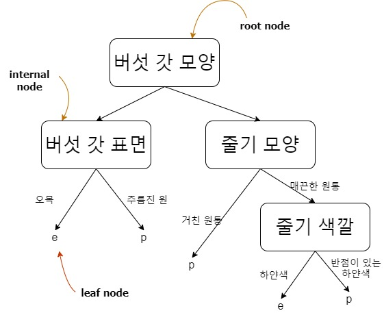

* root node: decision tree의 가장 상단에 있는 노드로서, 들어오는 edge는 없고 0개 이상의 edge(s)를 포함하는 노드 입니다.

* internal node : 정확히 하나의 들어오는 edge와 2개 또는 그 이상의 나가는 edges를 가지고 있습니다. 또한 데이터들이 가지는 특정 attribute에 대해 조건(<strong>condition</strong>)에 따라 나누는(split) 역할을 합니다. 

* leaf or terminal node : 단 하나의 들어오는 edge만 있고 나가는 edge는 없는 노드로서 <strong>class label</strong>을 대표합니다.

최적의 split attribute condition을 찾기 위한 attribute test condition방법에서 impurity가 사용됩니다.
특정 노드 t의 impurity값은

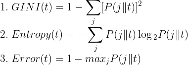

위 impurity 값이 최소가 되는 방향으로, 
또는 GAIN값이 최대가 되는 방향으로 split condition을 정하게 됩니다.

---

## GINI index

CART, SLIQ, SPRINT 알고리즘에서 사용되며, impurity와 k개의 분할에 대한 Gini index에 가중치가 적용된 Gini split은 각각 아래와 같습니다.

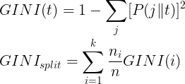

Example)

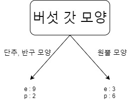

왼쪽 leaf node를 t1, 오른쪽 leaf node를 t2라 하면,

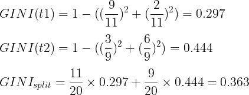

***

## Entropy
ID3, C4.5 알고리즘에서 사용되며, impurity와 Gain split 값은 아래와 같습니다. 

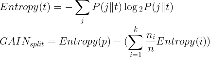

###### ( Entropy(p) : before split )

 
 

#### Entropy가 가지는 의미
정보 이론에서 information gain(정보 이득량)은 해당 사건이 자주 발생하거나, 많이 분포되어 있다면 정보량(informational value)이 적다고 하고, 해당 사건의 분포가 적거나, 드물게, 또는 잘 일어
나지 않는다면 정보량이 많다고 합니다.
 
 
예를 들어, 주머니안에 [사탕, 사탕, 사탕, 초콜렛, 사탕]이 들어 있다면, 사탕이 나올 확률은 $\frac{4}{5}$, 초콜렛이 나올 확률은 $\frac{1}{5}$입니다.
 
이 때 사탕의 정보량은 : 0.097
 
초콜렛의 정보량은 : 0.699 로 초콜렛을 뽑을 사건이 더 정보량이 높게 나옵니다.
 
 
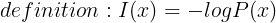
 
 
정의에서 알수 있듯이, 좀 더 잘 일어날수 있는 사건(P(x))의 경우 높은 값을 가지고, 반대로 드물게 일어나는 사건일수록 낮은 값을 가짐을 알 수 있습니다.
 
여기서 entropy는 무작위 시행의 결과로 인한 기대되는 평균 정보량을 의미합니다. 즉 정보의 혼잡도를 뜻합니다.
>Entropy measures the expected (i.e., average) amount of information conveyed by identifying the outcome of a random trial.(from wikipedia)

 

Example)

왼쪽 leaf node를 t1, 오른쪽 leaf node를 t2라 하면,

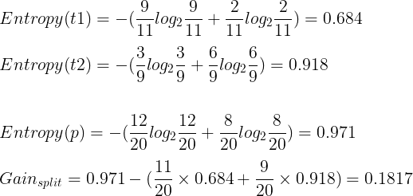

***

## Misclassification Error

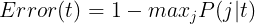

Example)

왼쪽 leaf node를 t1, 오른쪽 leaf node를 t2라 하면,

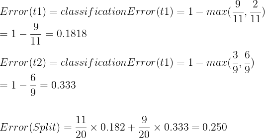

 

***

문제는 이러한 impurity 값을 작게 하기 위해 최대한 split 가지수를 많이 늘릴수도 있습니다. 가령, 극단적인 예시의 경우 데이터에서 각각의 record가 고유한 id를 가질 때 
split condition으로 id에 대해 record개수 만큼 split을 하게 된다면 impurity값은 작아지겠지만 우리가 얻고자 하는 유의미한 모델은 아니게 됩니다. 따라서 이러한
split에 대해 제약을 주기 위해 SplitINFO가 사용 됩니다.

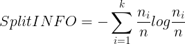

따라서 split에 대한 제약이 적용된 gain은

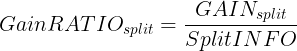

Example)GINI index 예제에 splitINFO를 적용하면,

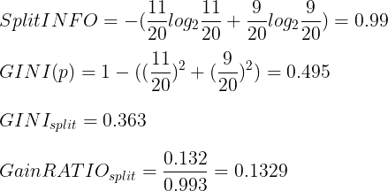

***

## Overfitting, Underfitting problems

#### 용어 설명

1. Training Errors : training data에 대해 잘 못 예측(분류)하는 비율로 측정

2. Generalization errors : test 데이터에 대한 잘 못 예측(분류)하는 비율로 측정

#### Overfitting

모델의 complexity가 복잡하거나 data의 noise(missing value, outlier등등)의 존재, 또는 충분치 않은 학습 데이터의 개수에 의해서 발생하거나 
training data에만 치우치게 학습하여 test data에 대해서는
잘 예측을 하지 못하여 generalization error가 큰 경우 입니다.

#### Underfitting

overfitting과는 반대로 모델의 complexity가 낮아져 training error가 높은 경우 입니다.

***

그렇다면, decision tree model을 만들 때 언제 sub tree 생성을 멈춰야 하는가가 또 문제입니다.
두 가지 방법으로,
* pre-pruning : tree를 만들면서 stop을 확인하는 경우, 다음과 같은 기준이 적용 될수 있음

	* information gain threshold를 만족하는 attribute가 없을 때
	* tree가 최대 깊이에 도달 했을 때
	* 현재 sub tree에 있는 example의 수가 일정 개수 이상의 example 기준을 못 넘겼을 때

* post-pruning : 될수 있는 한 tree를 깊게 만든 뒤, 효율적이지 못한 sub tree에 대해 가지치기를 적용

이러한 방법들은 overfitting을 방지하기 위해 사용 될 수 있습니다.

***

## Rapid Miner를 이용한 실습

순서

1. Data preparation

2. Learning model

3. Apply test data

***

### Data preparation

target class를 포함하여 23개의 attribute를 가지고 있으며 record의 개수는 8,124개 입니다. 이 중 70퍼센트를 learning data, 나머지 30퍼센트를 test data로 활용합니다.

예시 데이터셋의 경우, missing attribute, label이 없습니다.
 

 
우선, 모델에서 예측해야 할 target class를 정해주어야 합니다. 우리가 알고자하는 것은 식용 유무이므로 class가 target이 됩니다.
 

 
따라서 rapid miner의 process 중에서 set role을 통해 class를 target class로 정해줍니다.
 
그리고 모델을 학습할 데이터와 테스트 할 데이터가 필요하므로, 전체 데이터의 70퍼센트를 학습용 데이터와 나머지 30퍼센트를 테스트 데이터로 분리해주는 
split data process를 적용 해 줍니다.
 

 
 

 

### Learning model

split process 블록에서 첫번째 out port가 70퍼센트의 데이터를 가지고 있으므로 decision tree의 tra port로 이어줍니다.
 

 
decision tree의 parameter는 다음과 같이 적용하였습니다.
 

 
앞 포스트에서 언급한 여러 parameter가 있으며, gain ratio를 적용 하였습니다.

### Apply test data to model

decision tree 블록의 mod output port를 apply model 블록의 mod input port로, split 블록의 두번째 output port를 apply model의 unl input port로 이어줍니다.
 

 
버섯 데이터를 decision tree의 모델로 구현하면 아래와 같이 나오며
 

전체 2,437개의 example중에서 2,434개를 올바르게 예측 하였고, 나머지 3개의 example이 잘못된 예측을 하였습니다.
 

 
버섯 데이터 출처 : https://www.kaggle.com/uciml/mushroom-classification/