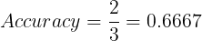
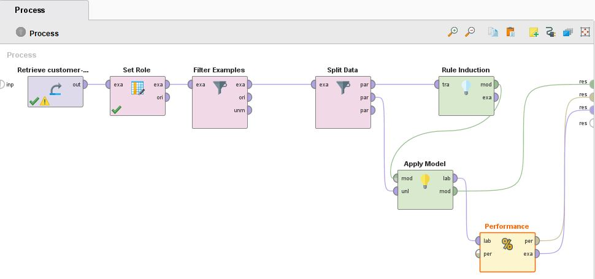

# Rule induction 개요

앞의 decision tree와는 다르게, 특정 class label에 부합하기 위한 attribute 선행 조건들을 and로 묶은 rule set을 정합니다.
그리고 예측하고자 하는 example의 class label을 rule set을 통해 label을 판별하는 모델입니다.
 
 

### Definition

 
 
위와 같은 if...then...else로 이루어진 rule이 집합의 형태로 이루어져 있으며 이를 rule set이라 합니다.
이 rule set에 의해 record의 label을 판별하게 되는데
여기서 해당 rule이 특정 record의 조건에 부합한다면 해당 rule은 그 record를 <strong>cover</strong>한다고 하며, 
반대로 record는 해당 rule을 <strong>trigger</strong> 한다고 말할수도 있습니다.

***

### 용어설명

 
전체 데이터 중에서 해당 rule을 trigger하는 record의 비율을 의미

 
 

 
trigger하는 record 중에서 해당 rule set의 label과 같은 record의 비율을 의미

Example)
<table>
	<th>Id</th>
	<th>와드 여부</th>
	<th>맵 활용 여부</th>
	<th>비속어 사용 횟수</th>
	<th>티어</th>
	<tr>
		<td>1</td>
		<td>Yes</td>
		<td>Yes</td>
		<td>2</td>
		<td>플레티넘</td>
	</tr>
	<tr>
		<td>2</td>
		<td>Yes</td>
		<td>No</td>
		<td>5</td>
		<td>브론즈</td>
	</tr>
	<tr>
		<td>3</td>
		<td>Yes</td>
		<td>No</td>
		<td>8</td>
		<td>브론즈</td>
	</tr>
	<tr style="color:red;">
		<td>4</td>
		<td>No</td>
		<td>No</td>
		<td>55</td>
		<td>브론즈</td>
	</tr>
	<tr style="color:red;">
		<td>5</td>
		<td>No</td>
		<td>No</td>
		<td>32</td>
		<td>브론즈</td>
	</tr>
	<tr>
		<td>6</td>
		<td>Yes</td>
		<td>Yes</td>
		<td>12</td>
		<td>플레티넘</td>
	</tr>
	<tr style="color:red;">
		<td>7</td>
		<td>No</td>
		<td>No</td>
		<td>35</td>
		<td>플레티넘</td>
	</tr>
	<tr>
		<td>8</td>
		<td>Yes</td>
		<td>Yes</td>
		<td>10</td>
		<td>플레티넘</td>
	</tr>
	<tr>
		<td>9</td>
		<td>Yes</td>
		<td>Yes</td>
		<td>27</td>
		<td>플레티넘</td>
	</tr>
	<tr>
		<td>10</td>
		<td>No</td>
		<td>Yes</td>
		<td>29</td>
		<td>브론즈</td>
	</tr>
</table>

Rule set : (와드 여부 = No) and (맵 활용 여부 = No) and (비속어 사용 횟수 > 20) = 브론즈
 
 

 

이 중에서 class label이 브론즈인 record는 2개 이므로,
 

 
 

#### Mutually exclusive rule set

모든 instance들이 많아야 하나의 rule에 의해서만 cover 될 때
 
 
Not mutually exclusive rule set일 때는,
 
1. ordered rules : rule들만의 우선순위에 따라 순위를 정의하여 순위가 높은 rule의 class로 분류, oreder rule set은 decision list로도 알려짐

2. unordered rules : majority 또는 weighted voting을 통해 class label을 결정
 
 

#### Exhaustive rule set
모든 instance들이 최소한 하나 이상의 rule에 의해서만 cover 될 때
 
 
Not exhaustive rule set일 때, default rule과 default class를 이용
 
* default class : 보통은 모델내에 현재 존재하는 rule에 의해 cover가 되지 않는 training record들 중에서 다수인 class를 default class로 채택
 

<h4>따라서 mutually exclusive & exhaustive rule set은 <U>모든 instance들</U>이 <U>하나의 rule</U>에 의해서만 cover 된다는 것을 의미</h4>
 

***

### Building classification rules

* Direct method : data set으로 부터 바로 rule 생성

* Indirect method : 다른 분류 모델로 부터 rule을 생성

#### Direct method

sequential covering approach
> grow rules in a greedy fashion based on evaluation measure
> extract the rules one class at a time.

1. Start from an empty rule.

2. Grow a rule using the <strong>Learn - one - rule function</strong>.

3. Remove training instaces coverd by the rule.

4. Repeat step (2) and (3) untile stopping criterion is method

##### What is Learn-one-rule function?   최대한 많은 positive examples를, 또는 최대한 적은 negative example을 가지도록 하는 rule을 찾아 내는 것.

그렇다면 어떤 rule이 best rule인지 평가할 수 있는 척도가 필요함.
 

***

### Metrics for rule evaluation

rule에 대한 평가를 하기 위한 척도

Example)

Training set은 50개의 positive 와 100개의 negative example을 가지며, 아래와 같은 rule이 있을 때 각 matrics의 value는?
 
 
 * r1 : covers 20 positive and 5 negative examples
  
 * r2 : covers 5 positive and 1 negative examples
  

 
마지막으로 그렇다면, rule 생성을 언제 까지 해야 하는가?
 

***

### Stopping criterion and rule pruning

언제 rule 생성을 그만 두어야 하는가?  
1. Gain 이나 accuracy를 계산

2. 계산된 gain, 또는 accuracy에 변화가 없을 때 stop하거나 다른 rule 생성을 시작

#### Rule pruning
* generalization errors를 개선하는데 이용될 수 있음.
* decision tree의 post-pruning과 비슷
 

***

### Rule growing strategy

* General to spcific : empty rule에서 시작해서 특정 기준을 만족 할 때까지 rule의 quality를 개선 시키는 방향으로 rule을 추가

* Specific to general : 무작위로 positive example 하나를 선택해서 특정 기준을 만족할 때 까지, 더 많은 positive example을 포함 하는 방향으로 rule을 제거

***

## Rapid Miner를 이용한 실습

과제에서 제공받은 data set customer-churn data를 이용하여 rule기반 classifier를 학습하여 최종 모델을 만듭니다.

모델및 데이터 preparation 요구사항

1. target label은 churn

2. Data set은 target label에 대해 값이 있는 것만 사용(no missing value)

3. training은 전체 데이터의 70퍼센트만 사용

4. test는 전체 데이터의 30퍼센트만 사용

5. data sampling은 stratified sampling을 사용

6. 성능 평가에 대한 parameter는 accuracy이용

***

1. Data preparation

Rapid miner에서 제공하는 샘플 데이터와는 달리 어느 attribute가 target label인지 명시할 필요가 있습니다.

따라서 <strong>set role</strong> 프로세스를 추가하여, 우리가 예측하고자 하는 Churn을 target label로 지정합니다.

 
 

제공받거나, 또는 측정한 data set에서 모든 instance가 가지고 있는 모든 attribute에 대해 값을 무조건 다 가질 수는 없는경우가 있습니다.

training을 할때, 이러한 특정 attribute에서 missing value를 가진 instance들은 제외하고자 할때 <strong>filter examples</strong> 프로세스를 추가합니다.

 
 

다음으로 제공받은 data set중에서 70퍼센트는 학습 데이터로, 나머지 30퍼센트는 test단계 때 사용하기 위해 <strong>split</strong> 프로세스를 추가합니다.

 
 

2. Modeling

Rule induction을 사용하여 분류하고자 하므로, Rule induction 프로세스를 추가합니다. 

사용하는 rule induction의 평가 척도는 information gain을 사용하였습니다.

 
 

3. Test and deployment

생성된 model을 이용하여 unseen data를 예측하기 위해 <strong>apply model</strong>프로세스를 추가하고, 예측된 결과에 대해 모델의 성능을 검증하기 위해 마지막으로
<strong>performance</strong>프로세스를 추가합니다.

 
 

4. 모델, 예측 결과

test data set(총 270개의 instance들)에 대해, 실제 Churn 값과 예측하였을 때의 Churn값, 그리고 예측할때의 confidence, 마지막으로 4개의 descriptive attribute를 보여줍니다.

생성된 rule induction의 모델을 보여줍니다.

