## KNN 개요

예측하고자 하는 test record와 가장 가까운 k개의 training record들을 찾아 class label을 판별하는 분류.
 
따라서 record(instance)들을 기반으로 단순히 모델을 만드는 것이 아니므로 instance-Based classifiers 
또는 Lazy-Learner 라고도 함.
 
 

### Definition

K개의 <strong>가장 가까운(closest)</strong> training record들을 찾아 해당 k개의 training record들의 class label에 따라 
unseen data의 label을 분류, 예측.
 

 

모든 record들은 n차원의 공간에서 하나의 점으로 표현할 수 있습니다. 여기서 n은 해당 data의 attribute의 개수를 뜻함.
 

### K 의미

 
고려되어지는 가장 가까운 training record의 <strong>개수</strong>
 
* k = 1일 때, 가장 가까운 하나의 training record의 class label을 채택. 하지만 그 training data가 outlier data여서 잘못 분류, 예측을 하게 될 수도 있음. 따라서 K를 2개 이상 선택

* K > 1일 때, voting에 의해 결정하며 보통 동점(tie)이 나오는 상황을 방지하고자 K는 홀 수를 사용.

***

### Measures of proximity

K-NN 알고리즘의 핵심은 test record와 가장 가까운 training record 사이에 <strong>거리를 측정하는 것</strong>

#### Matrics for measures of proximity
* Distance

* Correlation

* Similarity

  * Simple matching coefficient
  
  * Jaccard similarity
  
  * Cosine similarity
  
***

### Distance

n차원에서 두 점 사이의 거리
 
Example)

 
위와 같은 2개의 data가 있을 때,
 

 

 
각 attribute사이에서 단위가 다를 수 있으므로, 그런 경우 <strong>Normalization</strong>이 필요함

1. Range transformation : 값이 0 ~ 1 사이의 값을 가지도록 함.

2. Z-transformation : 모든 attribute들이 평균이 0이고 표준 편차가 1인 값을 가지도록 rescale.

 
 

이 외에도 Manhatten/Chebyshev distance가 있음.
1. Manhatten : 각각의 attribute의 차의 절댓값을 더한 것.

2. Chebyshev : 각각의 attributed의 차이 중에서 최댓(max)값.

Example)
 
위와 같은 2개의 데이터가 있을 때, Manhatten distance와 Chebyshev distance는 각각 아래와 같이 계산되어집니다.
 
 

 

***

### Correlation

두 data X, Y에 대해 각 attribute 사이의 <strong>linear relationship에 대한 척도</strong>

#### Pearson correlation

 
-1 : Perfect negative correlation, 1 : Perfect positive correlation
 
 

 
->x와 y의 covariance
 
 
*주의)위 수식에서 확률 변수 X, Y의 편차와 분산은 <strong>모집단의 편차, 분산이 아님</strong>!

 

 
 

Example)X = (1, 2, 3, 4, 5), Y = (10, 15, 35, 40, 55)
 
 

 

<table>
<tr>
	<td>X의 편차</td>
	<td>-2</td>
	<td>-1</td>.
	<td>0</td>
	<td>1</td>
	<td>2</td>
</tr>
<tr>
	<td>Y의 편차</td>
	<td>-21</td>
	<td>-16</td>.
	<td>4</td>
	<td>9</td>
	<td>24</td>
</tr>
</table>

따라서 Variance(X) = 2.5, Variance(Y) = 342.5
 

 

***

### Similarity

<h3>SMC(Simple Matching Coefficient)</h3>
-> Binary Attribute일 때, 사용될 수 있음
 

<h4>Definition</h4>

 
 
여기서 matching occurance는 동일한 attribute에 대해 둘 다 positive, 1인 경우 이거나, 또는 둘다 negative, 0 인 경우를 의미
 
 
Example) X = (1, 1, 0, 0), Y = (1, 0, 0, 1), Z = (1, 1, 0, 1)
 
 
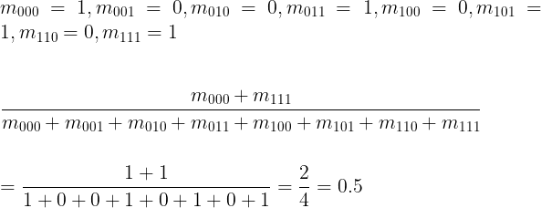
 
 

<h3>Jaccard Similarity</h3>
-> 마찬가지로 binary attribute에서 사용 되어지고, SMC와 비슷하지만 계산할 때 nonoccurrence frequency는 무시
 

<h4>Definition</h4>

 
-> 이 때 total occurrence 계산 시, negative matching(m(000))은 무시
 
 
Example)X = (1, 1, 0, 0), Y = (1, 0, 0, 1), Z = (1, 1, 0, 1)
 
 

 
 
 

<h3>Cosine similarity</h3>
-> 두 data 사이의 cosine angle을 측정
 

<h4>Definition</h4>

 
 
#### Euclidean distance는 보통 dense하고 continuous한 data에 사용하고 cosine, Jaccard similarity는 보통 sparse한 data에 사용.

### Issues of K-NN classifiers

1. K값 설정
	* K값이 너무 작다면, model이 noise data에 민감해 질수 있음.
	* K값이 너무 크다면, 다른 class label을 많이 포함할 수 있어, model이 잘못 분류할 수 있음.
 
	
2. Scaling, or Normalization
	* 단위가 큰 attribute에 의해 distance가 결정됨.
	* 따라서 단위를 통일시켜주기위해, normalization이 필요함.
 
	
3. Curse of dimensionality
	* Attribute의 개수가 많을 수록 dimensionality가 증가하게 되고, 그러면 data가 공간 상에서 sparse하게 됨. 이는 density와 distance값을 무의미 하게 함.
 
 

### K-NN에서 class label 결정하기

K개의 개수에 따라 class label을 선택할 때 voting을 사용할 수 있음
 
voting은 다음과 같이 적용 됨.
 

1. Majority vote을 사용. 즉, K개의 가까운 것들 중에서 다수의 class labels를 채택

2. 거리에 따른 weighted vote을 사용. 즉, 먼 거리일수록 voting에 영향을 적게 받도록 함. weight는 아래와 같이 계산.
	
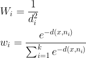	
	
 
 

### K-NN 특징 및 summary

* missing attribute가 있더라도 classifier가 꽤 robust함.

* lzay learner로서 단순히 training data들을 기억해놨다가 사용만 하기 때문에 input과 output사이의 상관관계를 설명할 수 없음

* Model을 만드는게 아니므로, modeling building하는데 시간이 많이 요구 되지않음. 단 거리나 similary와 같이 계산 요구가 높음.

***

## Rapid Miner를 이용한 실습

Rapid miner에서 제공하는 iris sample data set을 이용하여, K-NN 모델을 생성하고, 생성된 model을 검증 해 봅니다.

* Iris data set에 대한 attribute별 3D 분포도

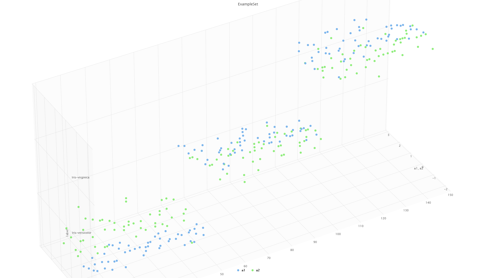

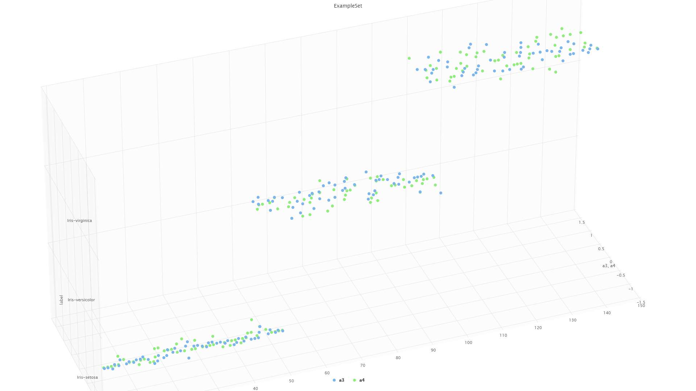

 
 

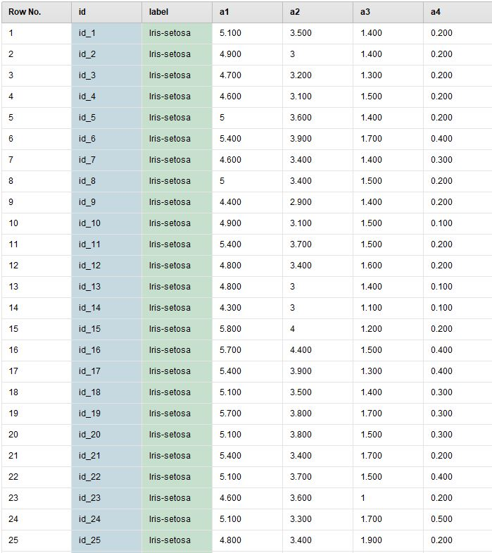

Iris sample data set의 경우, 각각의 data set의 서로 다른 범위, 또는 단위(unit)를 가집니다. 범위가 서로 다른 attribute를 사용하면 범위가 큰 attribute에 의해서만
model이 좌우될수 있으므로 normalization이 필요합니다.
 
 

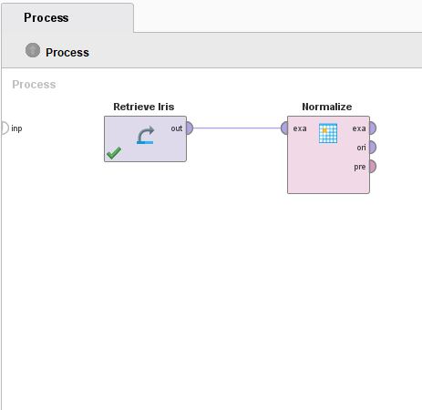

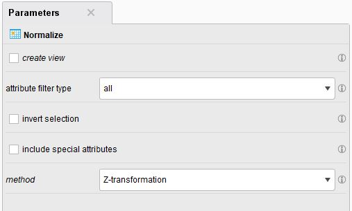

Normalization을 할때, z-transformation을 사용하였습니다.

 
 

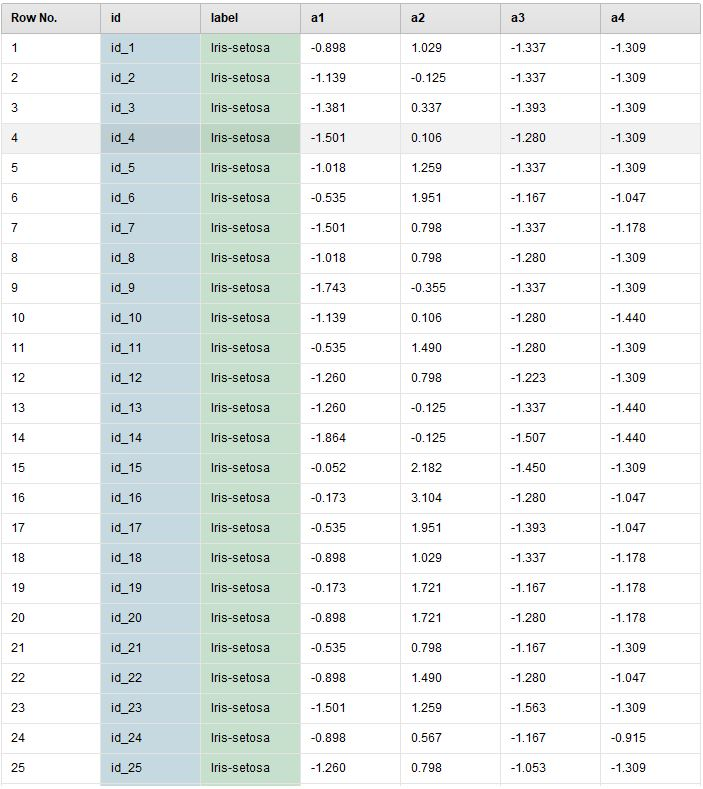

 
 

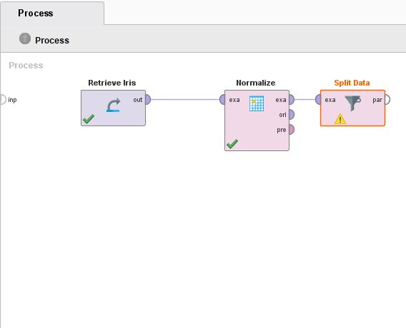
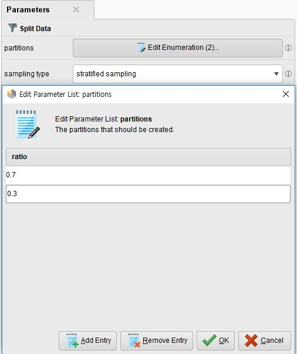

한정된 sample data를 가지고, training과 test를 해야하기 때문에 70:30의 비율로 각각 training data, test data로 split해줍니다.

 
 

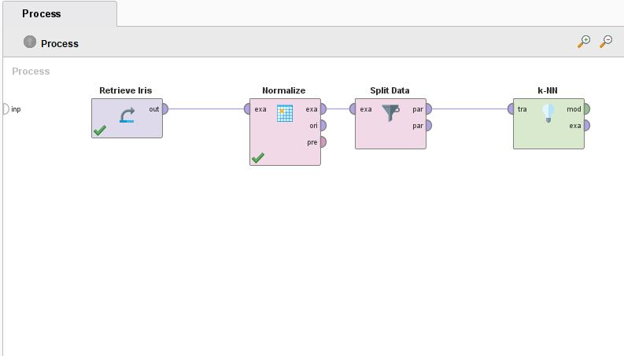
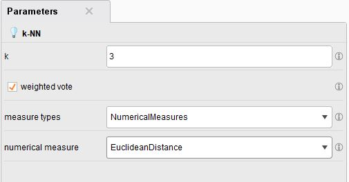

K-NN 모델링 process를 적용할 때, 고려해야 되는 K의 개수는 3개로 하였습니다. distance는 유클리디언 distance로 하였으며, 그 때의 측정 type은
 모든 training attribute들이 numeric이므로 numericMeasure로 하였습니다.

 
 

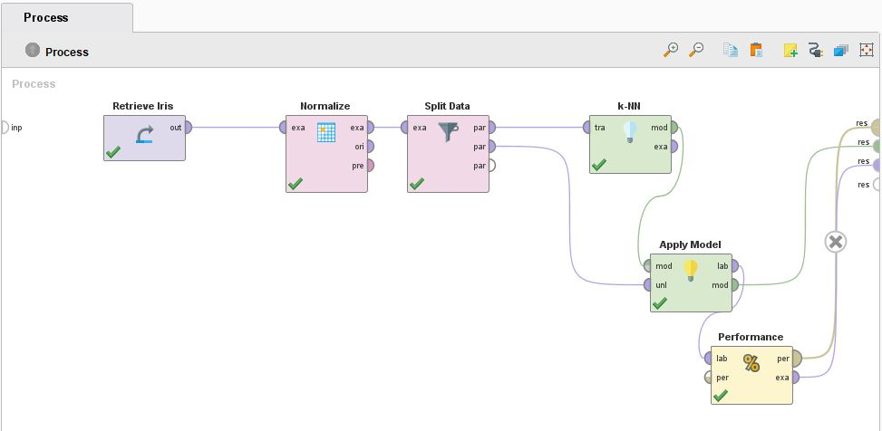
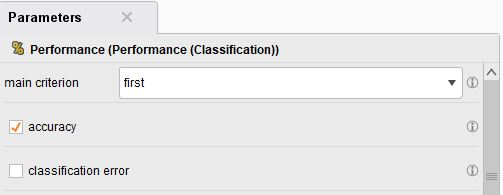

Test data set에 대해 K-NN 모델을 적용하고, 예측 된 결과에 대한 performance를 측정하는 프로세스를 추가해줍니다. 

 
 

K-NN은 주어진 training data set으로부터 예측하고자 하는 data set까지의 distance를 측정하여 예측하는 lazy model이기 때문에 
따로 model이 생성되지는 않습니다. 

 
 

## 출처 및 참고문헌

KNN 이론 및 rapid miner 사용법 : 강의 PPT 자료