# 개요

* 통계와 확률에 기반

* 많은 적용 사례에서, attribute set과 class variable사이의 상관 관계는 <strong>non-deterministic</strong>함.

 
->why?) noise data나 data set에는 포함되지 않지만 분류하는데 영향을 주는 다른 요소에 의해, 어떤 test example의 attribute set이 training example의 attribute set과 동일하다고 해서 확정저긍로 똑같은 class labelss로 분류가 안될 수 있음.
	
 
결론적으로, <strong>attribute set과 class variable사이의 modeling probablistic relationship를 ananlysis하기 위한 적근 방법</strong>

 

### Notations and terminologies

X : the evidence, factors, or attribute set.
  
주의)Not individual attribute.
 
 
Y : the outcome, taget, or class label.
 
 
P(Y) : prior probability.
 
 * 주어진 data set에서 해당 outcome의  발생빈도.
 
 * data set으로부터 구할 수 있음.
 
 

P(Y\|X) : the conditional probability.
 * 조건부 확률로서, evidence X가 일어났을 때 outcome Y일 확률.
 * posterior probability라고도 불림.
 
 

### Conditional probability 

->Bayes Theorem을 이용하여 계산
 
 

 

 
P(X|Y) : Class conditional probability

* 해당 class label Y일 때, attribute set이 특정값 evidence X일 확률

* data set으로부터 계산할 수 있음

* posterior probability 계산하는데 중요
 
 

### Definition of general case

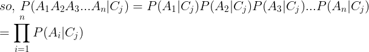

 
 
(단, attribute set A에서 <strong>각 attribute는 independence</strong> 하다고 가정!)
 
 

 
따라서 확률값이 큰 target condition일 때, 해당 target label로 분류.
 
 
 
만약, attribute value가 continuous하다면 probability density estimation을 이용
 

 
 
-> 연속적인 값을 가지는 특정 attribute A가 class C일 때, 정규분포(normal distribution)를 따른다고 가정
 
 

### Issues of Naive Bayes Classifier

조건부 확률 값 중, 하나 이상이 0이라면 전체 posterior probability는 0이 됨. 이와 같은 문제는 아래와 같이 term을 준 확률 계산으로 해결.
 
 

 

### Naive Bayes classifie 특징

1. noise data에 robust.

2. missing value(s)를 가진 instance는 확률 계산과정에서 무시하고 계산 할 수 있음.

3. 전체적으로 attribute를 고려할 때, 계산 결과가 거의 균등하게 분포하므로 관계 없는 attribute에 robust함.

4. 만약 attribute 사이에 서로 <strong>not independent하다면</strong>, model의 performance가 낮아짐. 따라서 이럴 때는 다른 technique가 필요함.

 

### Example

주어진 test record의 attribute가 X = (Refund = No, Divorced, Income = 10k)일때, Naive Bayes Classifier를 이용한다면 어느 class label로 분류?
 
 
-> P(Evade = Yes| X)와 P(Evade = No| X)중에서 값이 높은것
 
<table>
<th>Id</th>
<th>Refund</th>
<th>Marital Status</th>
<th>Taxable Income</th>
<th style="color:yellow">Evade</th>
<tr>
	<td>1</td>
	<td>Yes</td>
	<td>Single</td>
	<td>125K</td>
	<td style="color:red;">No</td>
</tr>
<tr>
	<td>2</td>
	<td>No</td>
	<td>Married</td>
	<td>100k</td>
	<td style="color:red;">No</td>
</tr>
<tr>
	<td>3</td>
	<td>No</td>
	<td>Single</td>
	<td>70K</td>
	<td style="color:red;">No</td>
</tr>
<tr>
	<td>4</td>
	<td>Yes</td>
	<td>Married</td>
	<td>120K</td>
	<td style="color:red;">No</td>
</tr>
<tr>
	<td>5</td>
	<td>No</td>
	<td>Divorced</td>
	<td>95K</td>
	<td style="color:red;">Yes</td>
</tr>
<tr>
	<td>6</td>
	<td>No</td>
	<td>Married</td>
	<td>60K</td>
	<td style="color:red;">No</td>
</tr>
<tr>
	<td>7</td>
	<td>Yes</td>
	<td>Divorced</td>
	<td>220K</td>
	<td style="color:red;">No</td>
</tr>
<tr>
	<td>8</td>
	<td>No</td>
	<td>Single</td>
	<td>85K</td>
	<td style="color:red;">Yes</td>
</tr>
<tr>
	<td>9</td>
	<td>No</td>
	<td>Married</td>
	<td>75K</td>
	<td style="color:red;">No</td>
</tr>
<tr>
	<td>10</td>
	<td>No</td>
	<td>Single</td>
	<td>90K</td>
	<td style="color:red;">Yes</td>
</tr>
</table>
 

 
여기서 P(X)는 P(No|X)일 때도 동일한 값이므로, 단순히 확률값의 상대적인 크기 비교에는 필요가 없으므로 계산 X.
 
 
P(X|Yes) = P(Refund = No|Yes)P(Divorced|Yes)P(Income=120K|Yes)
 
 

 

 

 
P(X|No) = P(Refund = No|No)P(Divorced|No)P(Income=120K|No)
 
 

No target class에 대해서도, 정확한 확률값보다는 확률의 크기를 비교할것이므로 P(X) 계산 X.

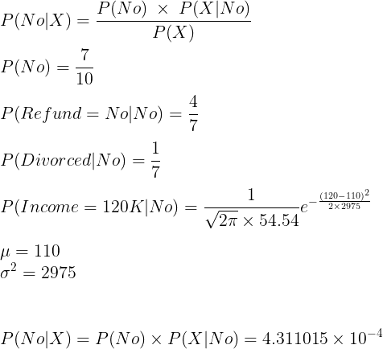

***

## Rapid Miner를 이용한 실습

Rapidminer에서 제공하는 golf sample 데이터를 이용하여 Naive Bayesian model을 만들고 test data로 golf를 하러 갈 수 있는지 예측해봅니다.

* Data preparation

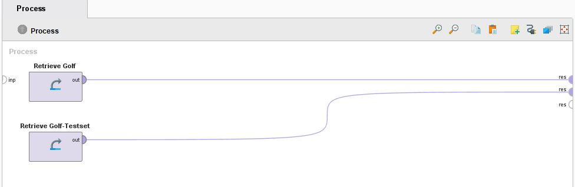

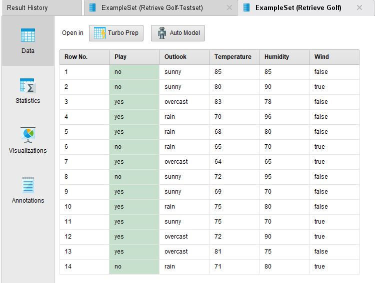

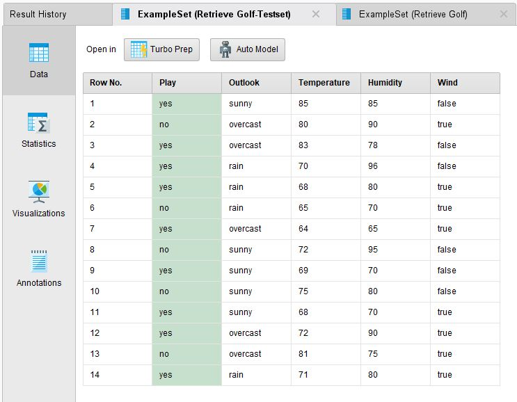

각각 training dataset과 생성된 model을 통해 예측할 test dataset입니다.

한개의 categorical class label과 2개의 categorical features, 그리고 2개의 continuous features를 가지고 있습니다.

 
 

* Modeling

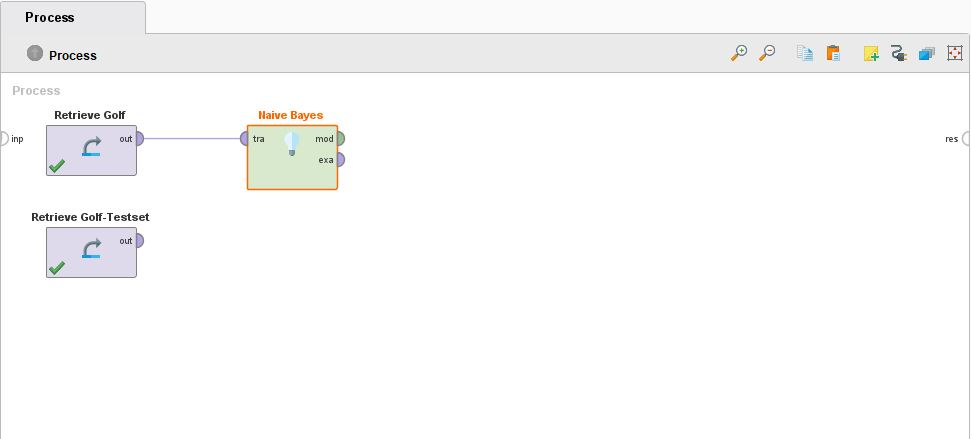

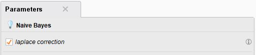

modeling을 하기위해 Naive Bayes process를 추가하고 training data의 link를 이어줍니다.

이 때, laplace correction을 사용합니다. laplace correction은 주어진 query(예측하고자하는 unknown data)가 가지고 있는 attribute에 대해서 특정 attribute의
 value를 가지지 않는 case가 발생할 수 있습니다. 이럴 경우, 해당 확률값은 0이 되고 조건부 확률을 계산할 때 확률값이 0인 term이 들어가게 되면 전체 확률이 0이 되어 유의미한 예측 모델이
  아니게 됩니다. 따라서 이런 case를 방지하기 위해 각각의 조건부 확률 term을 계산할 때 분자와 분모에 모두 1을 더하는 방법입니다.

 
 

* Apply modeling and evaluation

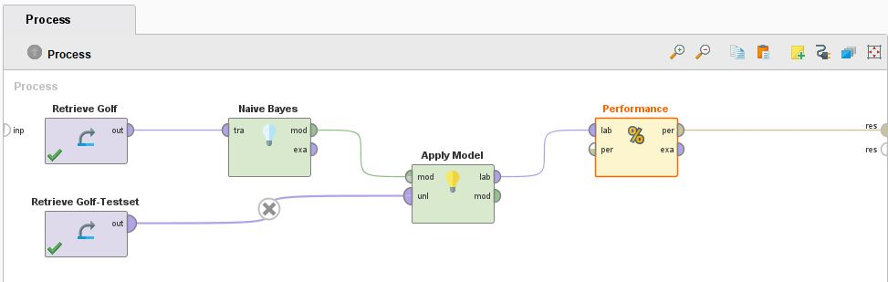

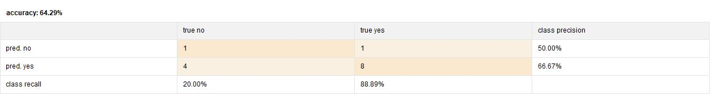

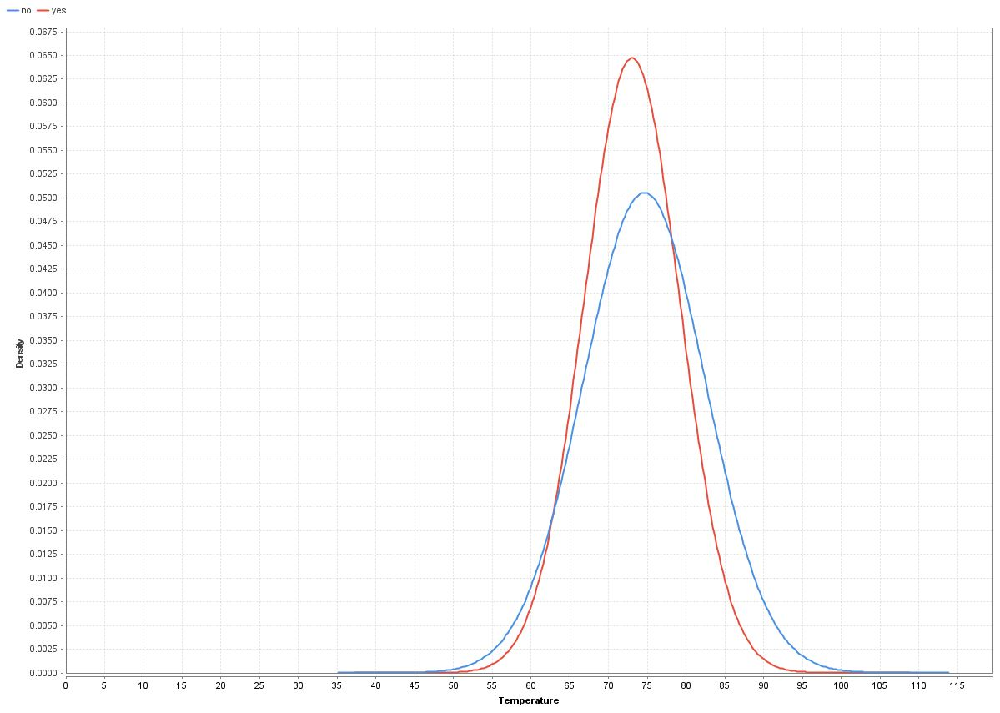

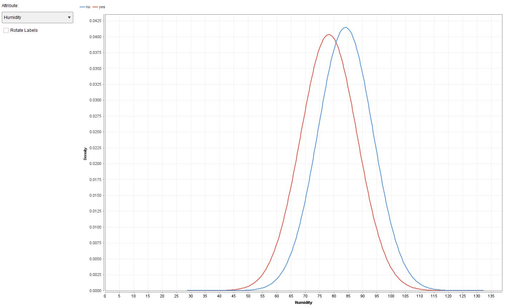

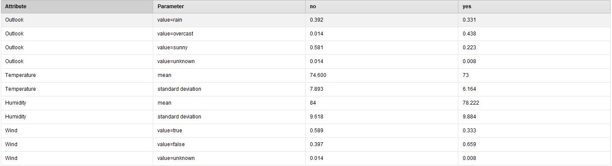

Data preparation단락에서 보았듯이, temperature feature와 humadity feature은 continuous한 값을 가지므로 가우스 확률 분포를 이용하여 확률값을 계산하게 됩니다.

마지막은 각각의 target == no, target == yes 일때의 attribute별 조건부 확률과 continuou feature의 확률 분포함수를 구할 때 필요한 평균과 표준편차입니다.

## 출처 및 참고문헌

Naive Bayes model에 대한 이론 및 rapid miner 사용법 : 강의 PPT 자료

