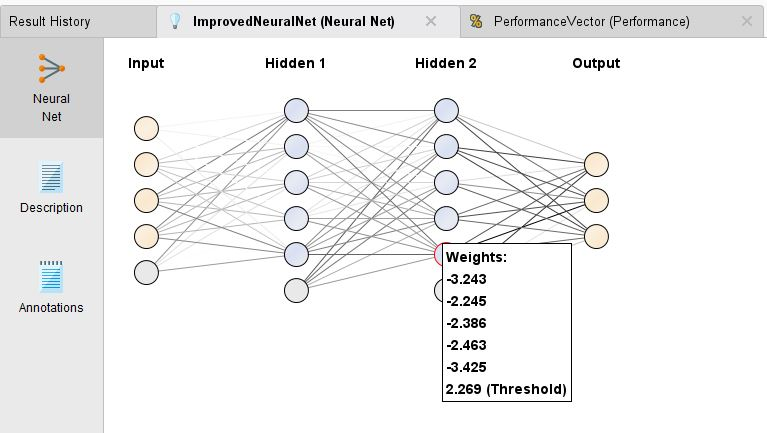

# 개요

인간 두뇌의 신경계에 착안한, 수학.계산적 모델

### Perceptron

* Simple neural network architectrue for learning a binary claasifier.

* input으로부터 weighted sum을 한 다음, threshold 값인 t를 빼고 그 값의 sign을 조사.

#### Definition

 
따라서 일반적인 case에 대한 perceptron model의 output은, 

 
 
여기서 아래 수식을 일정 기준 동안 반복하며 학습하는 동안 weight(w)값이 갱심된.
 
 

 
 

가질 수 있는 값의 변화로는...
1. prediction correct, weight is unchanged.

2. prediction error 

예측이 +1로 가기위해 weight가 증가하는 방향으로 변화.

3. prediction error 

예측이 0으로 가기위해 weight가 감소하는 방향으로 변화.

 
 

#### Learning rate lambda

* lambda값이 0에 가까울수록 새로운 weight값은 과거의 weight값에 영향을 많이 받음.

* lambda값이 1에 가까울수록 새로운 weight값은 현재 weight값을 조정하는 iteration에 좀 더 민감.
 
 

### Characteristic of Perceptron model

* Linearly separable classification problem인 경우, 최적의 해로 수렴하는 것을 보장해줌.

* 그러나 not linearly separable 한 경우, algorithm은 수렴하지 않음.
 
 

### Building Perceptron model

1. Topology와 activation function 정하기.

2. Initialize w, $\lambda$, and t. -> 보통 randomly하게 정함.

3. Error 값 계산.

4. weight 값 조정하는 것을 특정 기준을 만족하거나 수렴할 때까지 반복.
 
 

 
 

### Multilayer perceptron

XOR 문제와 같이, 기존의 perceptron으로는 선형적으로 분리할 수 없는 문제를 해결할 수 없음
 

 
* 한 개 이상의 hidden layer를 거쳐서 output을 생성.

* 보통 ANN는 이와같이 복잡하고, 비선형적인 입력과 출력의 관계를 modeling하는데 사용.
 
 

### Building MLP

1. Initialize the weights.

2. Training example의 class와 일치하도록 weight값을 조정(학습).

   * objective function : $E(\overrightarrow{w}) = \frac{1}{2}\sum_{i=1}^{N}(y_{i} - \hat{y_{i}})^{2}$.
  
   * weight를 갱신할 때는 objective function을 최소화 하는 방향으로 진행. 
  
   * 이 때, backpropagation algorithm이나 경사 하강법(gradient descent method)등을 이용.
   
   * Gradient descent : $w_{j} \leftarrow w_{j} - \lambda \frac{\partial E(\overrightarrow{w})}{\partial w_{j}}$
   
   * 
  
 
 

### Characteristic of ANN

* 경사 하강법의 경우, 종종 local minimum으로 수렴하는 경우가 있음. 이럴 경우, weight를 갱신할 때 momentum term을 주어 해결 가능.

* ANN를 학습하는데는 시간이 매우 오래 걸리지만, 한 번 model이 형성되면 test examples에 대해서는 빠르게 분류할 수 있음.

* Numeric data가 input data에 적합. numeric data가 아닐 경우 사전 작업이 필요. 

***

## Rapid Miner를 이용한 실습

학습에 필요한 data를 preparation하는 단계입니다. 

데이터를 나누기전에, Rapid miner에서 제공하는 sample iris data의 attribute가 a1, a2, a3, a4로 표시되어 있으므로 직관성을 위하여 rename을 해줍니다.

전체 데이터 셋중 70퍼센트는 training data로, 나머지 30퍼센트는 model evaluation에 쓰일 test data입니다.

Modeling하는 단계입니다.

Learning rate 람다는 0.01로 하였으며 2개의 hidden layer를 가지도록 하였습니다. 

2번째 hidden layer에 속한 특정 node의 weight값과 threshold(w0)입니다.

Activation function으로는 sigmoid함수를 사용했습니다.

***
  
## 출처 및 참고문헌

ANN에 대한 : 강의 PPT 자료

